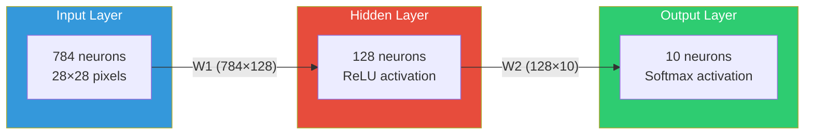
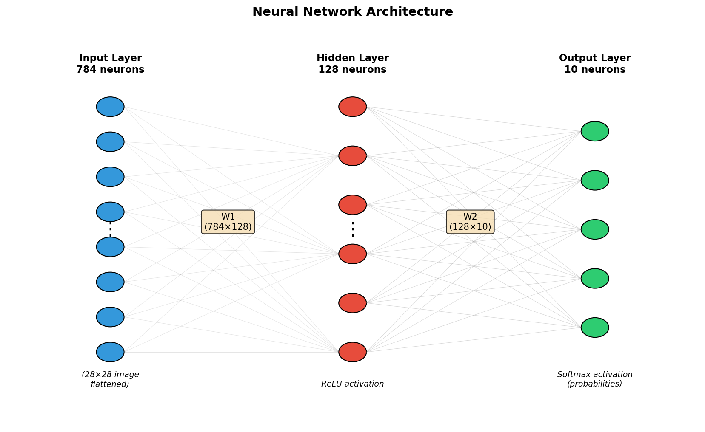
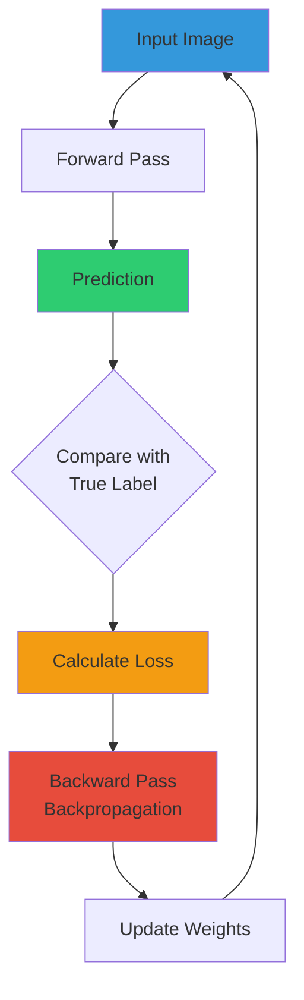
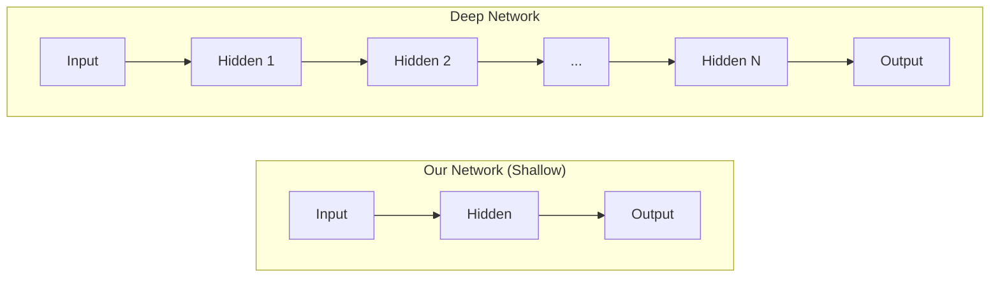

# Chapter 0: Neural Networks Overview

## What is a Neural Network?

A neural network is a computational model inspired by the human brain. It consists of interconnected "neurons" organized in layers that learn to recognize patterns in data.

At its core, a neural network is just a function that:
1. Takes an input (like an image)
2. Performs a series of mathematical transformations
3. Produces an output (like a classification)

The magic is that the network **learns** the right transformations by adjusting its internal parameters (weights) based on examples.

## Our Architecture

We'll build a simple but effective neural network for recognizing handwritten digits (0-9):





## Layer Breakdown

| Layer | Neurons | Purpose |
|-------|---------|---------|
| **Input** | 784 | One neuron per pixel (28×28 image flattened) |
| **Hidden** | 128 | Learns intermediate features (edges, curves, etc.) |
| **Output** | 10 | One neuron per digit class (0-9) |

## The Learning Process



### The Four Key Steps

1. **Forward Pass**: Data flows through the network, producing a prediction
2. **Loss Calculation**: We measure how wrong the prediction is
3. **Backward Pass**: We compute how each weight contributed to the error
4. **Weight Update**: We adjust weights to reduce future errors

## Mathematical Notation

Throughout these chapters, we'll use consistent notation:

| Symbol | Meaning |
|--------|---------|
| $X$ | Input data (batch of images) |
| $W_1, W_2$ | Weight matrices |
| $b_1, b_2$ | Bias vectors |
| $z$ | Pre-activation (linear output) |
| $a$ | Post-activation (after ReLU/Softmax) |
| $\hat{y}$ | Predicted probabilities |
| $y$ | True labels |
| $L$ | Loss value |

## What Makes This "Deep Learning"?

Our network has only one hidden layer, making it a "shallow" network. Deep learning uses many more layers, enabling the network to learn hierarchical features:



Even our simple network achieves **~97% accuracy** on MNIST - proof that you don't always need deep networks!

## Code Structure

```python
class NeuralNetwork:
    def __init__(self):
        # Initialize weights and biases

    def forward(self, X):
        # Compute prediction from input

    def backward(self, y):
        # Compute gradients via backpropagation

    def update_weights(self, learning_rate):
        # Gradient descent step
```

## Next Steps

In the following chapters, we'll dive deep into each component:

1. **[Forward Propagation](01_forward_propagation.md)** - How data flows through the network
2. **[Activation Functions](02_activation_functions.md)** - ReLU and Softmax explained
3. **[Loss Function](03_loss_function.md)** - Measuring prediction error
4. **[Backpropagation](04_backpropagation.md)** - Computing gradients
5. **[Training & Results](05_training_results.md)** - Putting it all together

---

*Total parameters in our network: 784×128 + 128 + 128×10 + 10 = **101,770** learnable values*
