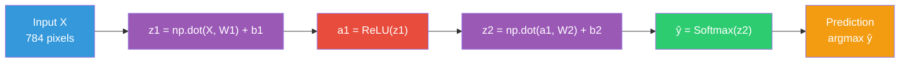
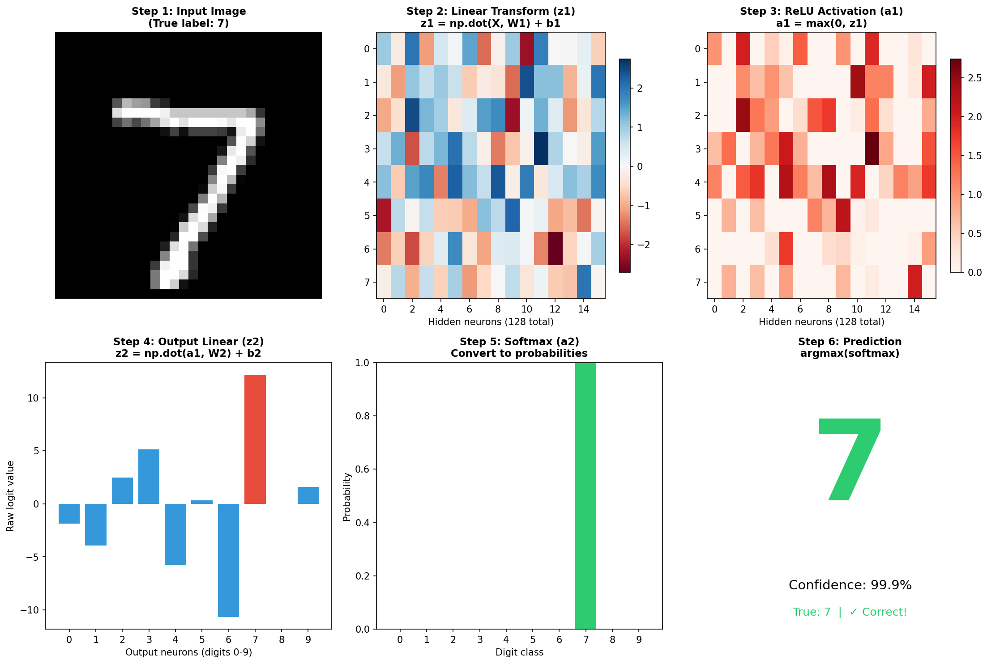
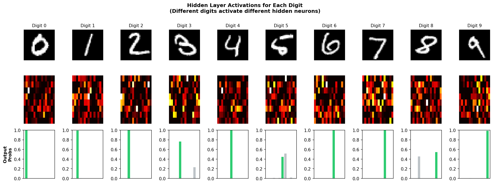

# Chapter 1: Forward Propagation

Forward propagation is the process of passing input data through the network to produce a prediction. It's called "forward" because data flows in one direction: from input to output.

## Overview



## Step-by-Step Visualization



The image above shows each transformation for a single digit image flowing through our network.

## Mathematical Description

### Step 1: Input
The input is a 28×28 grayscale image, flattened to a vector of 784 values (each between 0 and 1).

$$X \in \mathbb{R}^{batch \times 784}$$

### Step 2: First Linear Transformation
We multiply the input by weights and add bias:

$$z_1 = X \cdot W_1 + b_1$$

Where:
- $W_1 \in \mathbb{R}^{784 \times 128}$ (weight matrix)
- $b_1 \in \mathbb{R}^{128}$ (bias vector)
- $z_1 \in \mathbb{R}^{batch \times 128}$ (result)

**What this does**: Each of the 128 hidden neurons computes a weighted sum of all 784 input pixels.

### Step 3: ReLU Activation
Apply the ReLU (Rectified Linear Unit) function element-wise:

$$a_1 = \text{ReLU}(z_1) = \max(0, z_1)$$

**What this does**: Introduces non-linearity. Without this, stacking layers would just be one big linear transformation.

### Step 4: Second Linear Transformation

$$z_2 = a_1 \cdot W_2 + b_2$$

Where:
- $W_2 \in \mathbb{R}^{128 \times 10}$ (weight matrix)
- $b_2 \in \mathbb{R}^{10}$ (bias vector)
- $z_2 \in \mathbb{R}^{batch \times 10}$ (result, called "logits")

### Step 5: Softmax Activation
Convert logits to probabilities:

$$\hat{y}_i = \text{softmax}(z_2)_i = \frac{e^{z_{2,i}}}{\sum_{j=0}^{9} e^{z_{2,j}}}$$

**What this does**: Produces a probability distribution over the 10 digit classes. All values are positive and sum to 1.

### Step 6: Prediction
The predicted digit is the class with highest probability:

$$\text{prediction} = \text{argmax}(\hat{y})$$

## Code Implementation

```python
def forward(self, X):
    """
    Forward pass: compute predictions from input.

    X: (batch_size, 784) - input images
    Returns: (batch_size, 10) - probability of each digit
    """
    # Store input for backprop
    self.X = X

    # Layer 1: Linear transformation
    # Shape: np.dot((batch, 784), (784, 128)) + (128,) = (batch, 128)
    self.z1 = np.dot(X, self.W1) + self.b1

    # Layer 1: ReLU activation
    self.a1 = self.relu(self.z1)

    # Layer 2: Linear transformation
    # Shape: np.dot((batch, 128), (128, 10)) + (10,) = (batch, 10)
    self.z2 = np.dot(self.a1, self.W2) + self.b2

    # Layer 2: Softmax activation
    self.a2 = self.softmax(self.z2)

    return self.a2
```

### Key Points in the Code

1. **`@` operator**: Matrix multiplication (equivalent to `np.dot` or `np.matmul`)

2. **Broadcasting**: When we add `b1` (shape 128) to `z1` (shape batch×128), NumPy automatically "broadcasts" the bias to each sample in the batch

3. **Storing intermediate values**: We save `X`, `z1`, `a1`, `z2`, `a2` because we need them for backpropagation

## Shape Flow

Understanding tensor shapes is crucial for debugging:

```
Input X:        (64, 784)      # 64 images, 784 pixels each
                    ↓
W1:             (784, 128)     # Weights: input→hidden
                    ↓
z1 = np.dot(X, W1): (64, 128)  # 64 images, 128 hidden values
                    ↓
a1 = ReLU(z1):  (64, 128)      # Same shape, negative values zeroed
                    ↓
W2:             (128, 10)      # Weights: hidden→output
                    ↓
z2 = np.dot(a1, W2): (64, 10)  # 64 images, 10 logits each
                    ↓
ŷ = softmax:    (64, 10)       # 64 images, 10 probabilities each
```

## Why Store Intermediate Values?

During forward pass, we compute and store:
- `self.X` - needed to compute gradient of W1
- `self.z1` - needed for ReLU derivative
- `self.a1` - needed to compute gradient of W2
- `self.z2` - needed for softmax derivative
- `self.a2` - the prediction (also used in loss calculation)

These values are essential for backpropagation (Chapter 4).

## Result: What the Network Sees

After training, here's how the network processes different digits:



Each column shows:
1. **Top**: Input digit image
2. **Middle**: Hidden layer activations (which neurons fire)
3. **Bottom**: Output probabilities (prediction confidence)

Notice how different digits activate different patterns of hidden neurons!

## Summary

| Step | Operation | Shape Change | Purpose |
|------|-----------|--------------|---------|
| 1 | Input | - | 28×28 image → 784 vector |
| 2 | Linear (z1) | 784 → 128 | Weighted combination of pixels |
| 3 | ReLU (a1) | 128 → 128 | Add non-linearity |
| 4 | Linear (z2) | 128 → 10 | Weighted combination of features |
| 5 | Softmax (ŷ) | 10 → 10 | Convert to probabilities |
| 6 | Argmax | 10 → 1 | Select predicted class |

---

**Next**: [Chapter 2: Activation Functions](02_activation_functions.md) - Deep dive into ReLU and Softmax
