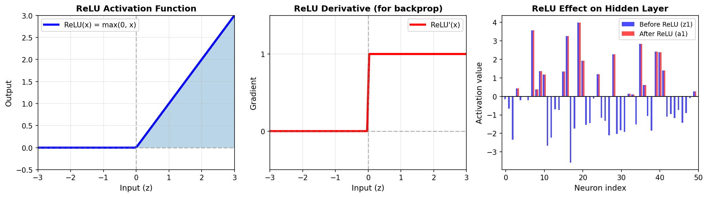
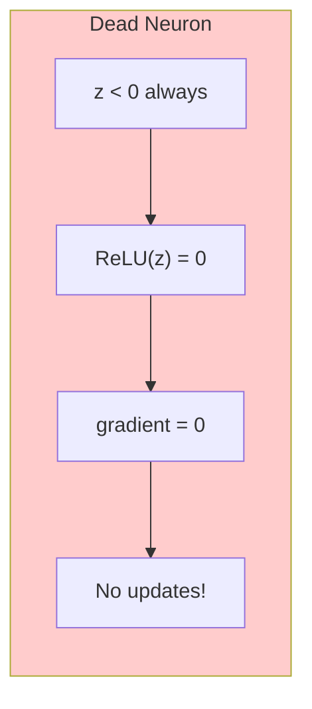
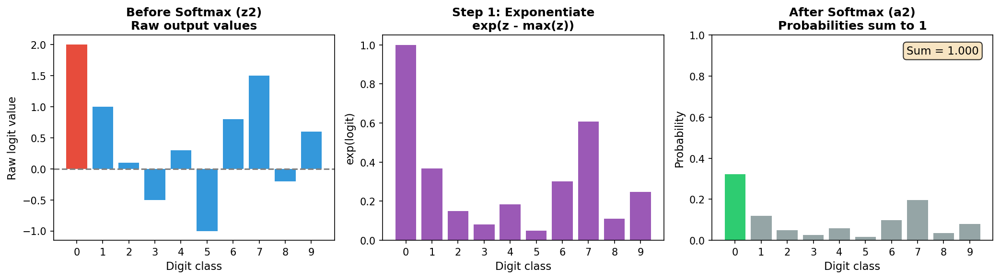
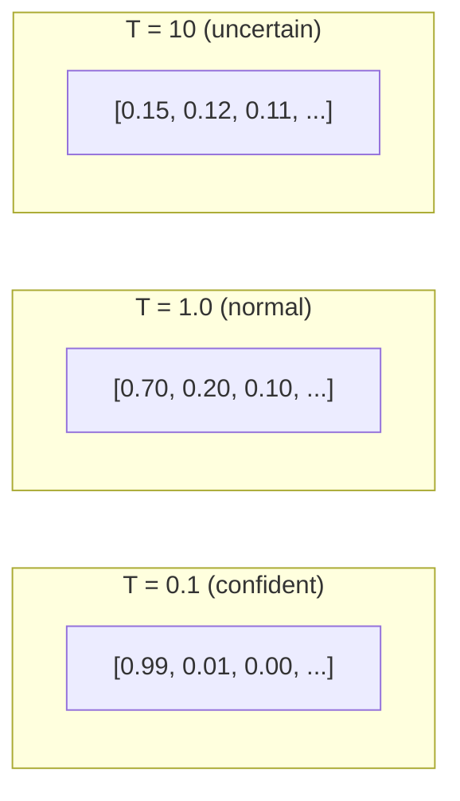
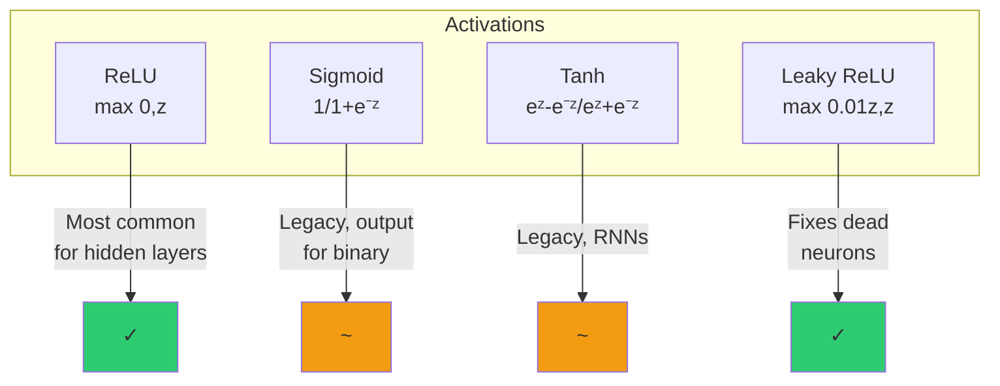
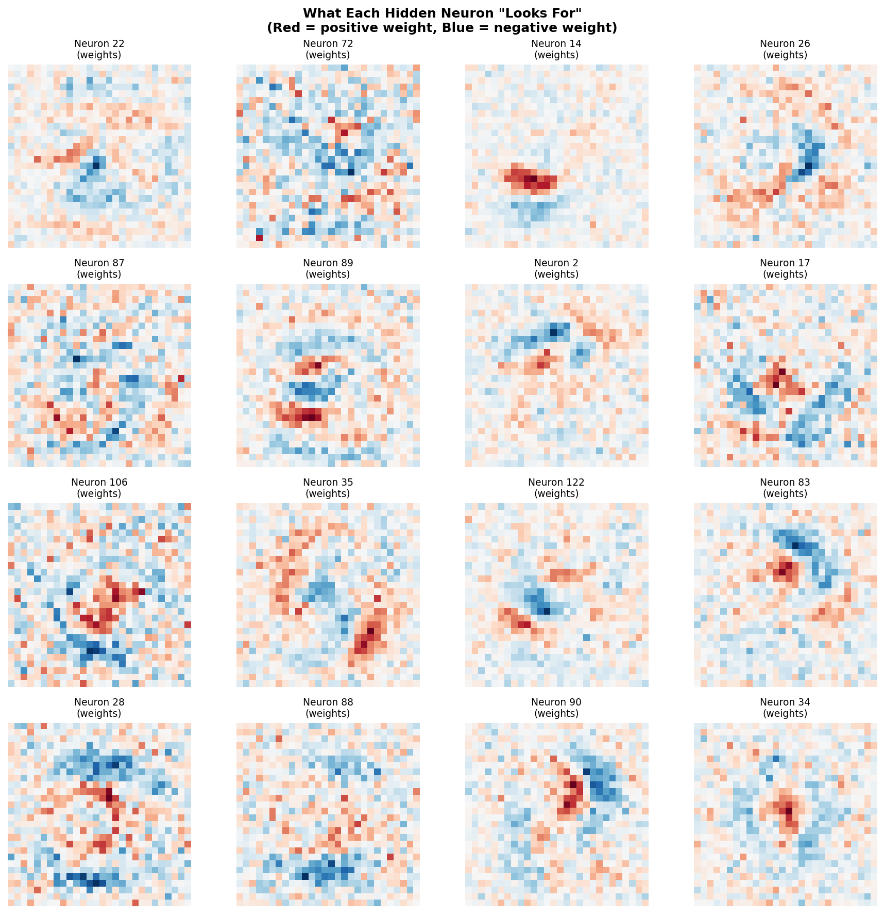
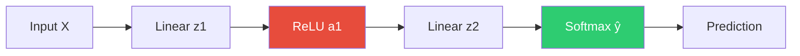

# Chapter 2: Activation Functions

Activation functions introduce **non-linearity** into neural networks. Without them, no matter how many layers you stack, the network would only be able to learn linear relationships.

## Why Non-Linearity Matters

Consider two linear transformations:
```
z1 = np.dot(X, W1) + b1
z2 = np.dot(z1, W2) + b2
```

This simplifies to:
```
z2 = np.dot(X, np.dot(W1, W2)) + np.dot(b1, W2) + b2
     = np.dot(X, W') + b'  (still linear!)
```

**Stacking linear layers without activation functions is equivalent to a single linear layer!**

Activation functions break this linearity, enabling networks to learn complex patterns.

## ReLU (Rectified Linear Unit)

ReLU is the most popular activation function for hidden layers.

### Definition

$$\text{ReLU}(z) = \max(0, z) = \begin{cases} z & \text{if } z > 0 \\ 0 & \text{if } z \leq 0 \end{cases}$$

### Visualization



### Properties

| Property | Value | Why It Matters |
|----------|-------|----------------|
| Range | $[0, \infty)$ | Always non-negative |
| Derivative | 0 or 1 | Simple gradient computation |
| Computational cost | Very low | Just a comparison |

### Code Implementation

```python
def relu(self, z):
    """ReLU activation: max(0, z)"""
    return np.maximum(0, z)

def relu_derivative(self, z):
    """Derivative of ReLU: 1 if z > 0, else 0"""
    return (z > 0).astype(float)
```

### Why ReLU Works Well

1. **No vanishing gradient**: Unlike sigmoid/tanh, positive inputs have gradient = 1
2. **Sparse activation**: Many neurons output 0, creating efficient representations
3. **Computationally simple**: Just `max(0, x)`

### The "Dead Neuron" Problem

If a neuron's output is always negative (due to unfortunate weight initialization), its gradient is always 0, and it never updates. This is called a "dead neuron."



**Solution**: Use proper weight initialization (Xavier/He) and reasonable learning rates.

---

## Softmax

Softmax converts raw output values (logits) into a probability distribution.

### Definition

$$\text{softmax}(z)_i = \frac{e^{z_i}}{\sum_{j=1}^{K} e^{z_j}}$$

For our 10-class problem (digits 0-9):

$$P(\text{digit} = i) = \frac{e^{z_i}}{\sum_{j=0}^{9} e^{z_j}}$$

### Visualization



### Properties

| Property | Value | Why It Matters |
|----------|-------|----------------|
| Range | $(0, 1)$ | Valid probabilities |
| Sum | Exactly 1 | Proper distribution |
| Monotonic | Preserves order | Highest logit → highest probability |

### Numerical Stability

Naive implementation can overflow:
```python
# BAD: exp(1000) = infinity!
exp_z = np.exp(z)
softmax = exp_z / exp_z.sum()
```

**Solution**: Subtract the maximum value first:
```python
# GOOD: exp(0) = 1 (manageable)
exp_z = np.exp(z - np.max(z))
softmax = exp_z / exp_z.sum()
```

This works because:
$$\frac{e^{z_i}}{\sum_j e^{z_j}} = \frac{e^{z_i - c}}{\sum_j e^{z_j - c}}$$

### Code Implementation

```python
def softmax(self, z):
    """
    Softmax activation: converts logits to probabilities.
    We subtract max(z) for numerical stability.
    """
    # Subtract max to prevent overflow (doesn't change result)
    exp_z = np.exp(z - np.max(z, axis=1, keepdims=True))
    return exp_z / np.sum(exp_z, axis=1, keepdims=True)
```

### Softmax Temperature

You can control "confidence" with a temperature parameter:

$$\text{softmax}(z/T)_i = \frac{e^{z_i/T}}{\sum_j e^{z_j/T}}$$



- **Low T** → More confident (approaches one-hot)
- **High T** → More uncertain (approaches uniform)

---

## Comparison: ReLU vs Softmax

| Aspect | ReLU | Softmax |
|--------|------|---------|
| **Used in** | Hidden layers | Output layer (classification) |
| **Output** | $[0, \infty)$ | $(0, 1)$, sums to 1 |
| **Purpose** | Add non-linearity | Convert to probabilities |
| **Applied** | Element-wise | Across all outputs |

---

## Other Activation Functions (For Reference)

### Sigmoid
$$\sigma(z) = \frac{1}{1 + e^{-z}}$$
- Range: $(0, 1)$
- Issue: Vanishing gradients for large |z|

### Tanh
$$\tanh(z) = \frac{e^z - e^{-z}}{e^z + e^{-z}}$$
- Range: $(-1, 1)$
- Issue: Also suffers from vanishing gradients

### Leaky ReLU
$$\text{LeakyReLU}(z) = \max(0.01z, z)$$
- Fixes dead neuron problem
- Small gradient for negative values



---

## Result: Hidden Neuron Activation Patterns

After training, each hidden neuron learns to detect specific patterns. Here's what the first 16 neurons "look for":



**Red regions**: When these pixels are bright, the neuron activates strongly
**Blue regions**: When these pixels are bright, the neuron activates weakly

Different neurons learn different patterns:
- Some detect vertical edges
- Some detect horizontal edges
- Some detect curves or corners
- Together, they form a "vocabulary" for describing digits

---

## Summary



| Function | Formula | Where Used | Why |
|----------|---------|------------|-----|
| **ReLU** | $\max(0, z)$ | Hidden layer | Non-linearity, simple gradients |
| **Softmax** | $\frac{e^{z_i}}{\sum e^{z_j}}$ | Output layer | Probability distribution |

---

**Next**: [Chapter 3: Loss Function](03_loss_function.md) - Measuring prediction error with cross-entropy
