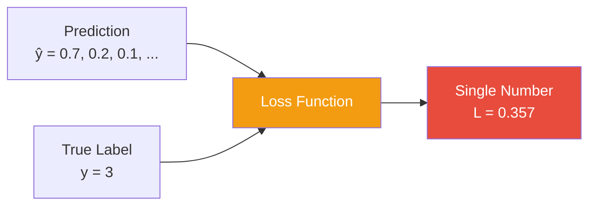
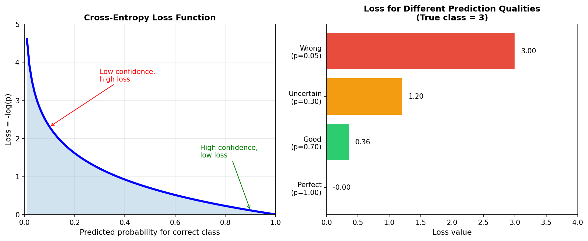
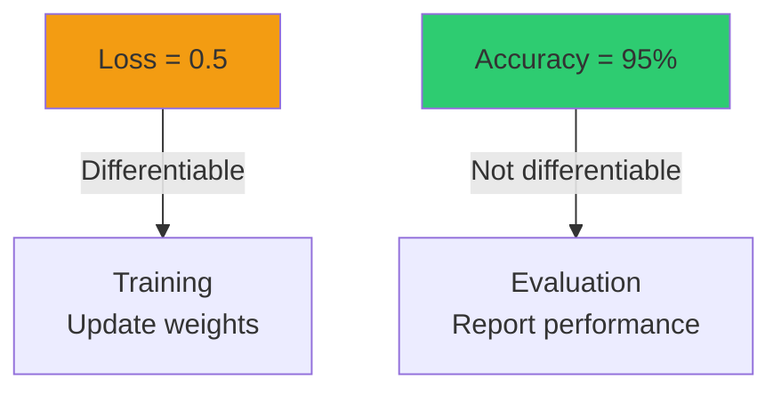
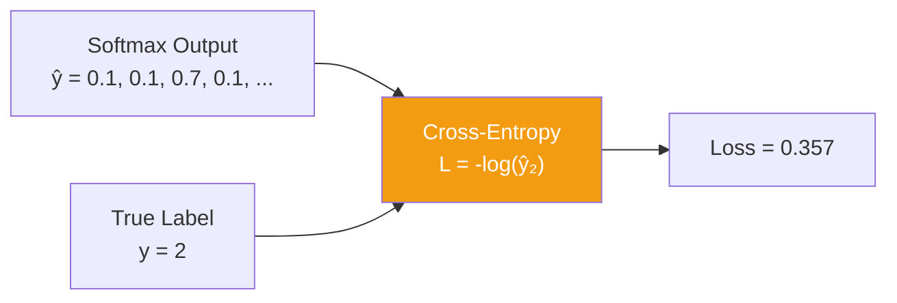

# Chapter 3: Loss Function (Cross-Entropy)

The loss function measures how wrong our predictions are. During training, we minimize this loss to improve the network's accuracy.

## Why We Need a Loss Function



The loss function converts a prediction and a true label into a **single number** that represents "how bad" the prediction was.

## Cross-Entropy Loss

For classification problems, we use **cross-entropy loss** (also called log loss).

### Intuition

Cross-entropy asks: "What probability did you assign to the correct class?"

- If you predicted 90% for the correct class → low loss (good!)
- If you predicted 10% for the correct class → high loss (bad!)

### Mathematical Definition

For a single sample:
$$L = -\log(\hat{y}_{true\_class})$$

For a batch of samples:
$$L = -\frac{1}{N}\sum_{i=1}^{N} \log(\hat{y}_{i, y_i})$$

Where:
- $\hat{y}$ = predicted probabilities (from softmax)
- $y$ = true class label
- $N$ = batch size

### Visualization



**Left plot**: The $-\log(p)$ curve shows that:
- When $p \to 1$ (confident and correct): $-\log(1) = 0$ (no loss)
- When $p \to 0$ (confident and wrong): $-\log(0) = \infty$ (infinite loss)

**Right plot**: Examples of loss values for different prediction qualities.

## Why Cross-Entropy?

### 1. Punishes Confident Wrong Predictions

```
Prediction: [0.01, 0.01, 0.01, 0.95, 0.01, 0.01, ...]
True class: 0
Loss = -log(0.01) = 4.6  (HIGH!)
```

Being 95% confident in the wrong answer is severely punished.

### 2. Works Well with Softmax

The gradient of softmax + cross-entropy simplifies beautifully:

$$\frac{\partial L}{\partial z_i} = \hat{y}_i - y_i$$

This is just "prediction minus truth" - elegant and efficient!

### 3. Information-Theoretic Foundation

Cross-entropy measures the difference between two probability distributions:
- The true distribution (one-hot: [0, 0, 0, 1, 0, ...])
- The predicted distribution (softmax output)

## Code Implementation

```python
def cross_entropy_loss(self, predictions, targets):
    """
    Cross-entropy loss for classification.

    predictions: (batch_size, 10) - probabilities from softmax
    targets: (batch_size,) - true class labels (0-9)

    Returns: scalar loss value
    """
    batch_size = predictions.shape[0]

    # Get probability assigned to the correct class for each sample
    # predictions[range(batch_size), targets] picks the right probability
    correct_probs = predictions[np.arange(batch_size), targets]

    # Cross-entropy: -log(correct_probability)
    # Add small epsilon to prevent log(0)
    loss = -np.mean(np.log(correct_probs + 1e-10))

    return loss
```

### Key Code Details

**Fancy indexing**: `predictions[np.arange(batch_size), targets]`

This extracts the probability of the true class for each sample:
```python
predictions = [[0.1, 0.2, 0.7],    # Sample 0
               [0.8, 0.1, 0.1]]    # Sample 1
targets = [2, 0]                    # True classes

# Result: [0.7, 0.8] (prob of class 2 for sample 0, class 0 for sample 1)
```

**Numerical stability**: `+ 1e-10`

Prevents `log(0) = -infinity` which would break training.

## Example Calculations

### Good Prediction
```
Predicted: [0.05, 0.05, 0.05, 0.80, 0.02, 0.01, 0.01, 0.01, 0.00, 0.00]
True class: 3
Probability for class 3: 0.80

Loss = -log(0.80) = 0.223  ✓ Low loss!
```

### Bad Prediction
```
Predicted: [0.40, 0.20, 0.15, 0.05, 0.05, 0.05, 0.03, 0.03, 0.02, 0.02]
True class: 3
Probability for class 3: 0.05

Loss = -log(0.05) = 2.996  ✗ High loss!
```

### Perfect Prediction
```
Predicted: [0, 0, 0, 1.0, 0, 0, 0, 0, 0, 0]
True class: 3
Probability for class 3: 1.0

Loss = -log(1.0) = 0.0  ✓ Perfect!
```

## Loss vs Accuracy

| Metric | What It Measures | Range | Used For |
|--------|-----------------|-------|----------|
| **Loss** | How wrong (continuously) | $[0, \infty)$ | Training (gradient descent) |
| **Accuracy** | % correct predictions | $[0, 1]$ | Evaluation (human-readable) |



**Why not train on accuracy directly?**

Accuracy is not differentiable - it jumps from 0 to 1 when a prediction crosses 50%. Loss provides smooth gradients for optimization.

## Loss During Training


The loss curve shows:
1. **Steep drop initially**: Network quickly learns basic patterns
2. **Gradual decrease**: Fine-tuning and learning harder examples
3. **Plateau**: Network has learned most of what it can

## Alternative Loss Functions

| Loss Function | Use Case | Formula |
|--------------|----------|---------|
| **Cross-Entropy** | Multi-class classification | $-\log(\hat{y}_{true})$ |
| **Binary Cross-Entropy** | Binary classification | $-[y\log\hat{y} + (1-y)\log(1-\hat{y})]$ |
| **Mean Squared Error** | Regression | $\frac{1}{n}\sum(y - \hat{y})^2$ |
| **Hinge Loss** | SVM-style classification | $\max(0, 1 - y \cdot \hat{y})$ |

## Summary



| Aspect | Cross-Entropy Loss |
|--------|-------------------|
| **Formula** | $L = -\log(\hat{y}_{true\_class})$ |
| **Range** | $[0, \infty)$ |
| **Perfect prediction** | Loss = 0 |
| **Random prediction** | Loss ≈ 2.3 (for 10 classes) |
| **Why use it** | Punishes confident wrong predictions, clean gradients |

---

**Next**: [Chapter 4: Backpropagation](04_backpropagation.md) - Computing gradients to update weights
