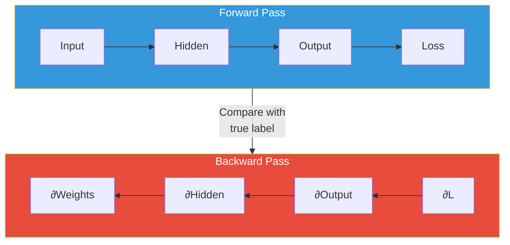
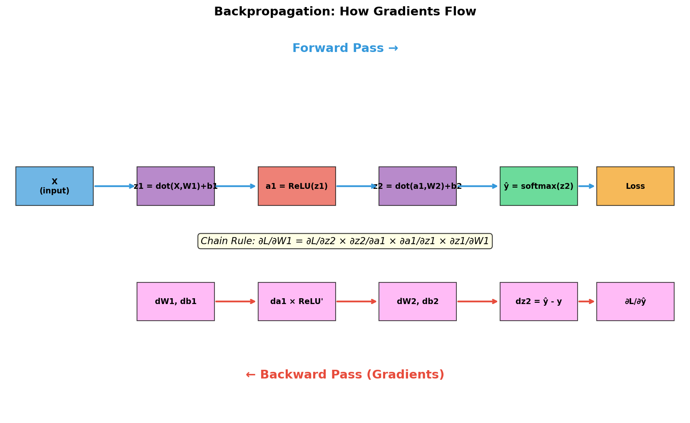
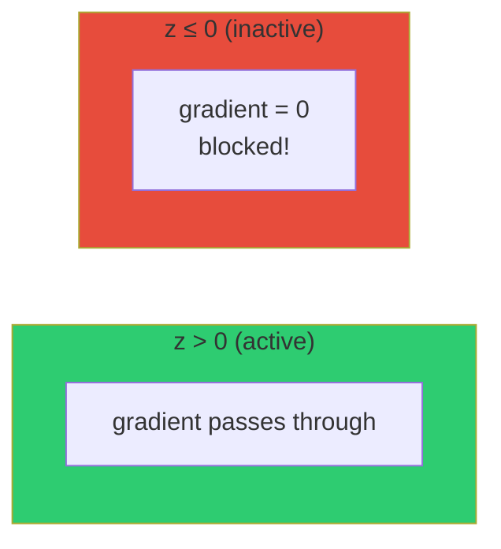
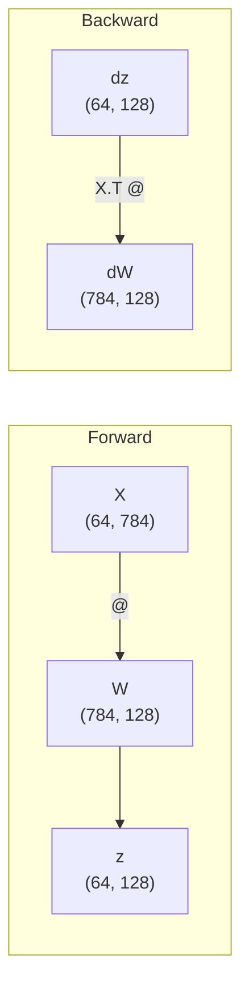
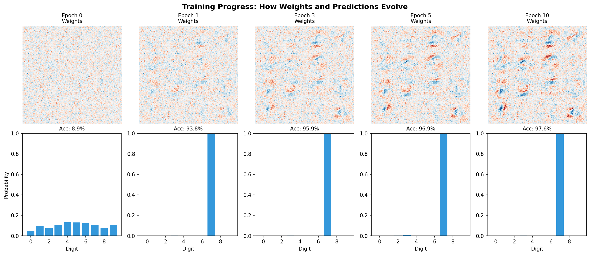
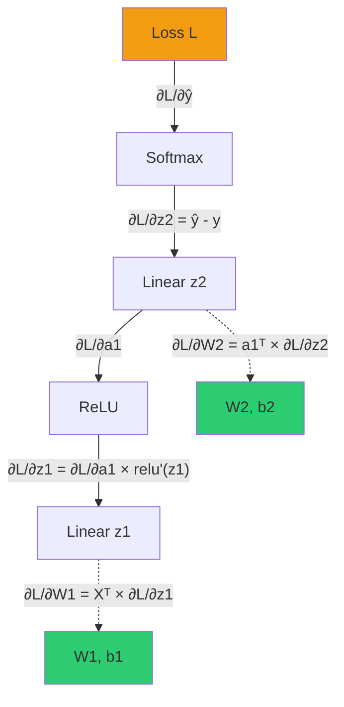

# Chapter 4: Backpropagation

Backpropagation is the algorithm that computes gradients - it tells us how to adjust each weight to reduce the loss. This is the **heart of neural network learning**.

## The Big Picture



**Forward pass**: Data flows input → output, producing a prediction
**Backward pass**: Gradients flow output → input, computing how to update weights

## The Chain Rule

Backpropagation is just the chain rule from calculus, applied systematically.

If $L = f(g(h(x)))$, then:

$$\frac{dL}{dx} = \frac{dL}{df} \cdot \frac{df}{dg} \cdot \frac{dg}{dh} \cdot \frac{dh}{dx}$$

Each layer passes its gradient to the previous layer, multiplied by its local gradient.

## Gradient Flow Diagram



## Step-by-Step Derivation

Let's derive the gradients for our network:

### Our Network
```
Forward:  X → z1 = X@W1+b1 → a1 = ReLU(z1) → z2 = a1@W2+b2 → ŷ = softmax(z2) → L
```

We need: $\frac{\partial L}{\partial W_1}$, $\frac{\partial L}{\partial b_1}$, $\frac{\partial L}{\partial W_2}$, $\frac{\partial L}{\partial b_2}$

---

### Step 1: Output Layer Gradient

The gradient of cross-entropy loss with softmax has a beautiful form:

$$\frac{\partial L}{\partial z_2} = \hat{y} - y_{onehot}$$

**Intuition**: The gradient is simply "prediction minus truth"

If the true label is 3 and we predicted `[0.1, 0.1, 0.1, 0.6, 0.1, ...]`:
```
gradient = [0.1, 0.1, 0.1, 0.6-1, 0.1, ...] = [0.1, 0.1, 0.1, -0.4, 0.1, ...]
```

This means: "decrease the wrong classes, increase class 3"

---

### Step 2: Gradients for W2 and b2

From $z_2 = a_1 \cdot W_2 + b_2$:

$$\frac{\partial L}{\partial W_2} = a_1^T \cdot \frac{\partial L}{\partial z_2}$$

$$\frac{\partial L}{\partial b_2} = \sum_{batch} \frac{\partial L}{\partial z_2}$$

**Intuition**: The gradient for a weight depends on:
1. How much the loss depends on the output (upstream gradient)
2. How much the output depends on this weight (local gradient = input $a_1$)

---

### Step 3: Backpropagate to Hidden Layer

$$\frac{\partial L}{\partial a_1} = \frac{\partial L}{\partial z_2} \cdot W_2^T$$

**Intuition**: The error for each hidden neuron is the weighted sum of output errors.

---

### Step 4: Backpropagate Through ReLU

$$\frac{\partial L}{\partial z_1} = \frac{\partial L}{\partial a_1} \odot \text{ReLU}'(z_1)$$

Where:
$$\text{ReLU}'(z) = \begin{cases} 1 & \text{if } z > 0 \\ 0 & \text{if } z \leq 0 \end{cases}$$

**Intuition**: Gradients only flow through neurons that were active (output > 0).



---

### Step 5: Gradients for W1 and b1

From $z_1 = X \cdot W_1 + b_1$:

$$\frac{\partial L}{\partial W_1} = X^T \cdot \frac{\partial L}{\partial z_1}$$

$$\frac{\partial L}{\partial b_1} = \sum_{batch} \frac{\partial L}{\partial z_1}$$

---

## Complete Gradient Summary

| Gradient | Formula | Shape |
|----------|---------|-------|
| $\frac{\partial L}{\partial z_2}$ | $\frac{1}{N}(\hat{y} - y_{onehot})$ | (batch, 10) |
| $\frac{\partial L}{\partial W_2}$ | $a_1^T \cdot dz_2$ | (128, 10) |
| $\frac{\partial L}{\partial b_2}$ | $\sum dz_2$ | (10,) |
| $\frac{\partial L}{\partial a_1}$ | $dz_2 \cdot W_2^T$ | (batch, 128) |
| $\frac{\partial L}{\partial z_1}$ | $da_1 \odot (z_1 > 0)$ | (batch, 128) |
| $\frac{\partial L}{\partial W_1}$ | $X^T \cdot dz_1$ | (784, 128) |
| $\frac{\partial L}{\partial b_1}$ | $\sum dz_1$ | (128,) |

## Code Implementation

```python
def backward(self, y):
    """
    Backpropagation: compute gradients of loss with respect to all parameters.

    y: (batch_size,) - true class labels
    """
    batch_size = y.shape[0]

    # =========================================================================
    # Step 1: Output layer gradient (Softmax + Cross-Entropy)
    # =========================================================================
    # Create one-hot encoding of labels
    one_hot_y = np.zeros_like(self.a2)
    one_hot_y[np.arange(batch_size), y] = 1

    # dL/dz2 = predictions - true_labels
    dz2 = (self.a2 - one_hot_y) / batch_size

    # =========================================================================
    # Step 2: Gradients for W2 and b2
    # =========================================================================
    # dL/dW2 = np.dot(a1.T, dz2)
    self.dW2 = np.dot(self.a1.T, dz2)   # Shape: (128, 10)
    # dL/db2 = sum(dz2)
    self.db2 = np.sum(dz2, axis=0)       # Shape: (10,)

    # =========================================================================
    # Step 3: Backpropagate to hidden layer
    # =========================================================================
    # dL/da1 = np.dot(dz2, W2.T)
    da1 = np.dot(dz2, self.W2.T)         # Shape: (batch, 128)

    # =========================================================================
    # Step 4: Backpropagate through ReLU
    # =========================================================================
    # dL/dz1 = da1 * relu'(z1)
    dz1 = da1 * (self.z1 > 0).astype(float)  # Shape: (batch, 128)

    # =========================================================================
    # Step 5: Gradients for W1 and b1
    # =========================================================================
    # dL/dW1 = np.dot(X.T, dz1)
    self.dW1 = np.dot(self.X.T, dz1)     # Shape: (784, 128)
    # dL/db1 = sum(dz1)
    self.db1 = np.sum(dz1, axis=0)        # Shape: (128,)
```

## Why Matrix Transpose?

The transpose operations might seem mysterious. Here's the intuition:

**Forward**: $z = np.dot(X, W)$ where X is (batch, in) and W is (in, out)
**Backward to W**: $dW = np.dot(X^T, dz)$

Think of it as: "which inputs contributed to which output errors?"



The transpose aligns dimensions so that:
- Each weight $W_{ij}$ receives gradients from all samples that used it
- Gradients are properly accumulated across the batch

## Gradient Checking (Debugging)

To verify backprop is correct, compare analytical gradients with numerical approximation:

$$\frac{\partial L}{\partial w} \approx \frac{L(w + \epsilon) - L(w - \epsilon)}{2\epsilon}$$

```python
def gradient_check(model, X, y, epsilon=1e-5):
    """Verify backprop gradients match numerical gradients."""
    # Get analytical gradient
    model.forward(X)
    model.backward(y)
    analytical = model.dW1[0, 0]

    # Compute numerical gradient
    original = model.W1[0, 0]

    model.W1[0, 0] = original + epsilon
    loss_plus = model.cross_entropy_loss(model.forward(X), y)

    model.W1[0, 0] = original - epsilon
    loss_minus = model.cross_entropy_loss(model.forward(X), y)

    numerical = (loss_plus - loss_minus) / (2 * epsilon)

    model.W1[0, 0] = original  # Restore

    print(f"Analytical: {analytical:.8f}")
    print(f"Numerical:  {numerical:.8f}")
    print(f"Difference: {abs(analytical - numerical):.2e}")
```

## Common Backprop Bugs

| Bug | Symptom | Fix |
|-----|---------|-----|
| Forgot to divide by batch_size | Loss explodes | Add `/batch_size` to dz2 |
| Wrong matrix dimensions | Shape error | Check transpose operations |
| Didn't store forward pass values | NaN gradients | Save z1, a1, etc. in forward() |
| Applied ReLU derivative to a1 instead of z1 | Slow learning | Apply to pre-activation z1 |

## Result: Learning in Action



Watch how weights evolve during training:
- **Epoch 0**: Random weights (noisy patterns)
- **Epoch 5**: Starting to see digit-like patterns
- **Epoch 10**: Clear feature detectors emerge

The network learns by repeatedly:
1. Making predictions (forward)
2. Computing gradients (backward)
3. Updating weights (gradient descent)

## Summary



| Concept | What It Does |
|---------|--------------|
| **Chain Rule** | Multiplies local gradients to get global gradient |
| **dz2 = ŷ - y** | Simple gradient for softmax + cross-entropy |
| **ReLU derivative** | Blocks gradients for inactive neurons |
| **Matrix transpose** | Aligns dimensions for gradient accumulation |

---

**Next**: [Chapter 5: Training & Results](05_training_results.md) - Gradient descent and final results
