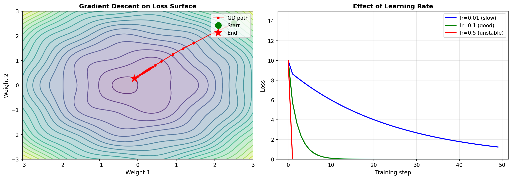
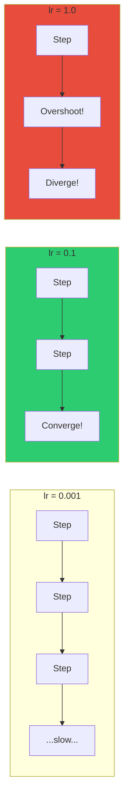
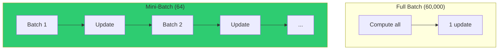
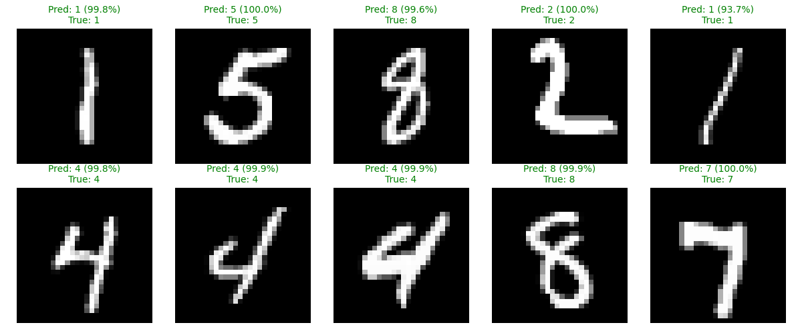
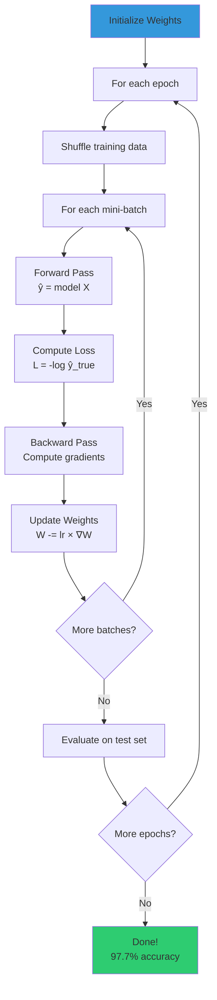
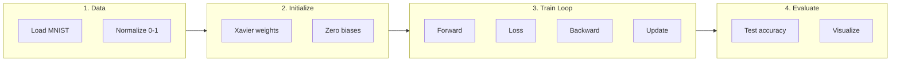

# Chapter 5: Training & Results

This chapter covers how we put everything together: gradient descent, mini-batch training, and the final results.

## Gradient Descent

Once we have gradients from backpropagation, we update weights to reduce the loss:

$$W_{new} = W_{old} - \eta \cdot \frac{\partial L}{\partial W}$$

Where $\eta$ (eta) is the **learning rate**.

### Visualization



**Left**: Gradient descent finding the minimum of a loss surface
**Right**: Effect of learning rate - too small is slow, too large is unstable

### Code Implementation

```python
def update_weights(self, learning_rate):
    """
    Gradient descent: update weights to reduce loss.

    new_weight = old_weight - learning_rate * gradient
    """
    self.W1 -= learning_rate * self.dW1
    self.b1 -= learning_rate * self.db1
    self.W2 -= learning_rate * self.dW2
    self.b2 -= learning_rate * self.db2
```

### Learning Rate Guidelines

| Learning Rate | Effect |
|--------------|--------|
| **Too small** (0.0001) | Slow convergence, may get stuck |
| **Good** (0.01 - 0.1) | Steady improvement |
| **Too large** (1.0+) | Unstable, loss may explode |



## Mini-Batch Training

Instead of using all 60,000 training samples at once, we use **mini-batches**.

### Why Mini-Batches?

| Approach | Pros | Cons |
|----------|------|------|
| **Full Batch** (all data) | Stable gradients | Slow, high memory |
| **Stochastic** (1 sample) | Fast updates | Noisy gradients |
| **Mini-Batch** (64-256) | Best of both | Slight noise (actually helps!) |



### Training Loop

```python
def train(model, X_train, y_train, epochs=10, batch_size=64, learning_rate=0.1):
    n_samples = X_train.shape[0]
    n_batches = n_samples // batch_size

    for epoch in range(epochs):
        # Shuffle data each epoch
        indices = np.random.permutation(n_samples)
        X_shuffled = X_train[indices]
        y_shuffled = y_train[indices]

        epoch_loss = 0

        # Process mini-batches
        for batch in range(n_batches):
            # Get batch data
            start = batch * batch_size
            end = start + batch_size
            X_batch = X_shuffled[start:end]
            y_batch = y_shuffled[start:end]

            # Forward pass
            predictions = model.forward(X_batch)

            # Compute loss
            loss = model.cross_entropy_loss(predictions, y_batch)
            epoch_loss += loss

            # Backward pass
            model.backward(y_batch)

            # Update weights
            model.update_weights(learning_rate)

        print(f"Epoch {epoch+1}: Loss = {epoch_loss/n_batches:.4f}")
```

### Why Shuffle Each Epoch?

Shuffling prevents the network from learning the order of samples. Without shuffling, the network might:
- Learn patterns in the data order
- Get stuck in local minima
- Have biased gradient estimates

## Training Progress


### Loss Curve Analysis

| Phase | Epochs | What's Happening |
|-------|--------|------------------|
| **Rapid Drop** | 1-2 | Learning basic patterns (edges, curves) |
| **Steady Decrease** | 3-7 | Fine-tuning, learning harder cases |
| **Plateau** | 8-10 | Converged, minor improvements |

### Train vs Test Accuracy

The gap between training and test accuracy indicates **generalization**:
- **Small gap**: Model generalizes well
- **Large gap**: Overfitting (memorizing training data)

Our model: Train ~98.8%, Test ~97.7% → Good generalization!

## Final Results

### Performance Metrics

| Metric | Value |
|--------|-------|
| Training Accuracy | 98.75% |
| Test Accuracy | **97.71%** |
| Training Time | ~30 seconds |
| Parameters | 101,770 |

### Sample Predictions



The network correctly classifies diverse handwriting styles with high confidence (93-100%).

### What the Network Learned


Each small image shows what one hidden neuron "looks for":
- **Edge detectors**: Neurons that activate for specific orientations
- **Curve detectors**: Neurons that respond to rounded shapes
- **Position detectors**: Neurons sensitive to strokes in specific locations

### Hidden Layer Activations


Each digit activates a unique pattern of hidden neurons:
- **Digit 1**: Vertical line detectors activate
- **Digit 0**: Curve detectors activate
- **Digit 7**: Diagonal + horizontal detectors activate

This is how the network "encodes" each digit class!

## Complete Training Flow



## Hyperparameters We Used

| Hyperparameter | Value | Why |
|----------------|-------|-----|
| Hidden neurons | 128 | Enough capacity for MNIST |
| Learning rate | 0.1 | Fast but stable |
| Batch size | 64 | Good balance |
| Epochs | 10 | Sufficient for convergence |

## Common Training Issues

| Problem | Symptom | Solution |
|---------|---------|----------|
| **Loss not decreasing** | Flat loss curve | Increase learning rate |
| **Loss exploding** | NaN or huge values | Decrease learning rate |
| **Overfitting** | Train >> Test accuracy | Add regularization, dropout |
| **Underfitting** | Both accuracies low | Add more neurons/layers |

## Summary

### The Complete Pipeline



### Key Takeaways

1. **Forward pass**: Matrix multiplications + activations
2. **Loss**: Cross-entropy measures prediction quality
3. **Backward pass**: Chain rule computes gradients
4. **Gradient descent**: Small steps toward lower loss
5. **Mini-batches**: Balance speed and stability

### What We Built

| Component | Lines of Code | Purpose |
|-----------|---------------|---------|
| Data loading | ~40 | Download and parse MNIST |
| Network class | ~80 | Forward, backward, update |
| Training loop | ~40 | Mini-batch gradient descent |
| Visualization | ~60 | Plots and diagnostics |
| **Total** | **~220** | Complete neural network! |

### Next Steps

To improve further, you could:
- Add more hidden layers (deep learning)
- Use dropout for regularization
- Try different optimizers (Adam, SGD with momentum)
- Use convolutional layers (CNNs)
- Compare with PyTorch implementation

---

## Appendix: Full Results Summary

```
============================================================
MNIST Neural Network from Scratch
============================================================
Training set: 60,000 images
Test set: 10,000 images
Network: 784 → 128 (ReLU) → 10 (Softmax)
Parameters: 101,770

Training Progress:
Epoch  1/10 | Loss: 0.3775 | Train: 92.9% | Test: 93.2%
Epoch  2/10 | Loss: 0.2008 | Train: 95.5% | Test: 95.2%
Epoch  3/10 | Loss: 0.1494 | Train: 96.6% | Test: 96.3%
Epoch  4/10 | Loss: 0.1197 | Train: 97.2% | Test: 96.7%
Epoch  5/10 | Loss: 0.1008 | Train: 97.6% | Test: 97.2%
Epoch  6/10 | Loss: 0.0865 | Train: 97.9% | Test: 97.2%
Epoch  7/10 | Loss: 0.0760 | Train: 98.0% | Test: 97.3%
Epoch  8/10 | Loss: 0.0681 | Train: 98.4% | Test: 97.7%
Epoch  9/10 | Loss: 0.0608 | Train: 98.4% | Test: 97.6%
Epoch 10/10 | Loss: 0.0559 | Train: 98.8% | Test: 97.7%

Final Test Accuracy: 97.71%
============================================================
```

---

**Congratulations!** You've built a neural network from scratch that achieves 97.7% accuracy on handwritten digit recognition. You understand:

- How data flows forward through layers
- How gradients flow backward via chain rule
- How weights update via gradient descent
- How mini-batch training works

This foundation applies to all deep learning - from image recognition to language models!
